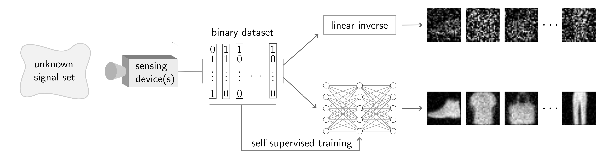

# Self-Supervised learning from Binary Measurements (SSBM)

Code of the paper 
["Learning to reconstruct signals from binary measurements alone"](https://arxiv.org/abs/2303.08691) by [Julian Tachella](https://tachella.github.io/)
and [Laurent Jacques](https://laurentjacques.gitlab.io/). 

We use the [deepinv library](https://deepinv.github.io/deepinv/)
for most of the code.



# Getting Started
1. Clone the repository
2. Install deepinv
```
pip install deepinv
```
3. Run the `main.py` file to train a self-supervised model. 
You can easily modify the dataset and other parameters in the `main.py` file.


# Citation
```
@article{tachella2023ssbm,
  title={Learning to reconstruct signals from binary measurements alone},
  author={Tachella, Julian and Jacques, Laurent},
  journal={arXiv preprint arXiv:2303.08691},
  year={2023}
}
```